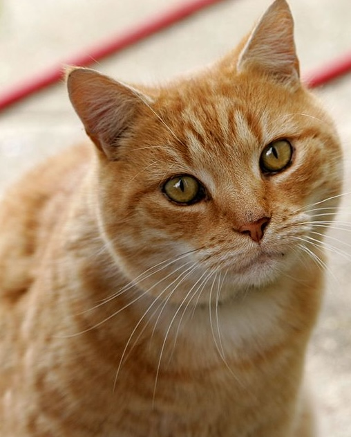
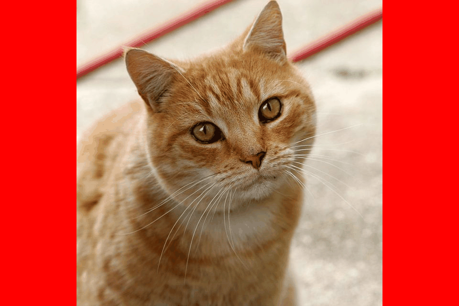

# gifing

A lightweight python tool for creating GIFs

<br>

<p align="center">
  
  
  
</p>

```python
from gifing import Gif

path = "tests/img"
file_path = [f"{path}/image{i}.jpg" for i in range(1, 4)]
gif = Gif(
    file_path,
    frame_duration=800,
    n_repeat_last_frame=3,
)
gif.set_labels(
    ["print", "hello", "world"],
    font_size=60,
    loc="bottom left",
    text_padding=40,
    box_padding=20,
    box_color="#fffcee",
    shadow_offset=15,
    font="Urbanist",
)
gif.set_background_color("red")
gif.set_size((900, 700), scale=1)
gif.make("img/output.gif")
```



This package offers:

- a streamlined approach to creating GIFs
- automatic image resizing
- ability to set a background color during resizing
- frame-by-frame label customization

It's a basic prototype of the functionality I envision for this tool. The API is still unstable.

<br>

### Installation

Install directly via pip (requires Python >=3.10):

```bash
pip install git+https://github.com/JosephBARBIERDARNAL/gifing.git
```

<br><br>

### Usage

Import the `Gif` class and provide a list of image file paths:

```python
from gifing import Gif

path = "tests/img"
gif = Gif(
    [f"{path}/image{i}.jpg" for i in range(1, 4)],
    frame_duration=800,  # Duration per frame (in milliseconds)
    n_repeat_last_frame=3,  # Repeat last frame 3x longer
)
```

You can set a background color, which is useful if your images have varying sizes:

```python
gif.set_background_color("black")
```

You can also set a custom size for your GIF. The `set_size` method allows you to specify a target size and scale factor:

```python
gif.set_size((300, 800), scale=1)  # Set the size to (300, 800) with no scaling
```

Finally, call the `make()` method to generate the GIF:

```python
gif.make()
```

By default, the GIF will be saved as `./output.gif`. You can customize the output path by passing it as an argument to the `make()` method.

<br><br>

## License

- The source code in this repository is licensed under the [MIT License](./LICENSE).
- The included fonts are licensed under the [SIL Open Font License, Version 1.1](https://openfontlicense.org).
