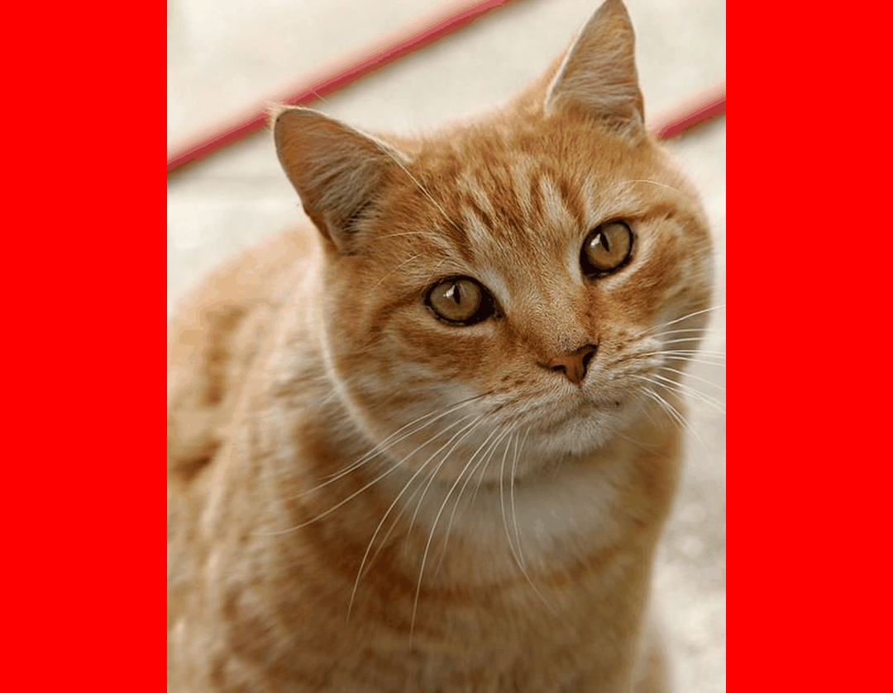

# gifing

> A lightweight python tool for creating GIFs



_&#8594; I mostly made this tool to explain how I make charts_

<br>

### Installation

Install directly via pip:

```bash
pip install git+https://github.com/JosephBARBIERDARNAL/gifing.git
```

<br><br>

### Usage

Import the `gif()` function and provide a list of image file paths:

```python
from gifing import gif

file_paths = ["image1.png", "image2.png", "image3.png"]
```

<br>

- **Create a GIF**

```python
gif(file_paths)
```

The GIF will be created and saved as `./output.gif`.

<br>

- **Specify a custom output path**

```python
gif(file_paths, output_path="img/mygif.gif")
```

The GIF will be saved at `img/mygif.gif`.

<br>

- **Set a custom background color**  
  _(Useful when images have varying sizes)_

```python
gif(file_paths, background_color="black")
```

The GIF will be saved as `./output.gif`.

<br>

- **Adjust the duration of each frame**

```python
gif(file_paths, frame_duration=500)  # 500ms per frame
```

The GIF will be saved as `./output.gif`.

<br>

- **Extend the display time of the last frame**  
  _(Specify a multiplier for the `frame_duration`)_

```python
gif(file_paths, n_repeat_last_frame=3)  # Last frame displayed 3x longer
```

The GIF will be saved as `./output.gif`.
